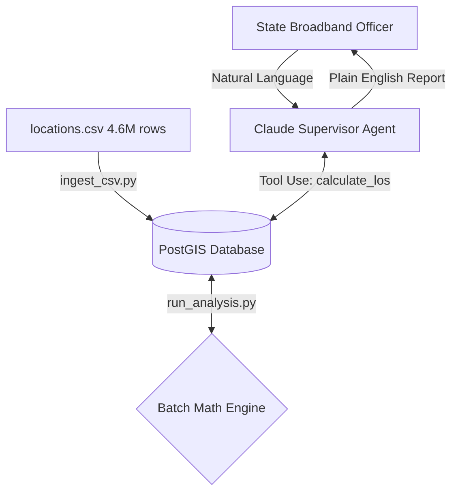

# Ready LEO Satellite Coverage Risk Analysis
Agent geospatial pipeline that finds locations that may be obstructed for satellite
broadband. Shows Starlink coverage for ~4.6M locations.

# Architecture


Boundaries:
- The supervisor agent is the one that orchestrates the whole thing. It calls the
data and analysis tools and then translates it back to the user in plain English.

- Data sourcing layer is all database I/O. No analysis logic.

- Analysis layer is all math, no direct database access

# Risk Tiers

| Tier | Obstruction Angle | English |
| --- | --- | --- |
| A | < 20 deg | Clear line of sight, low risk |
| B | 20 - 35 deg | Marginal clearance, medium risk |
| C | > 35 deg | Obstructions in the way, high risk |

The 20 deg threshold came from


# Installations/Setup
```bash
docker-compose up -d

pip install -r requirements.txt

cp .env.example .env

python src/process_csv.py

python src/run_analysis.py

python src/supervisor.py
```

# Decision Log

- Chose a "centralized" based approach as prompt mentions to have clear 
boundaries and is also easier to parallelize workers at scale. A single agent
handling everything could stall: if API call fails, then you would lose everything

- Used PostGIS for its spatial indexing, and it also allowed for geometry ops.
May go back if portability becomes an issue.

- Preloaded APIs over web search. This was to make it deterministic and has no
rate limit risk

- Batch SQL updates over per row calls. This decreases token cost drastically.

- Bulk inserts to make it faster