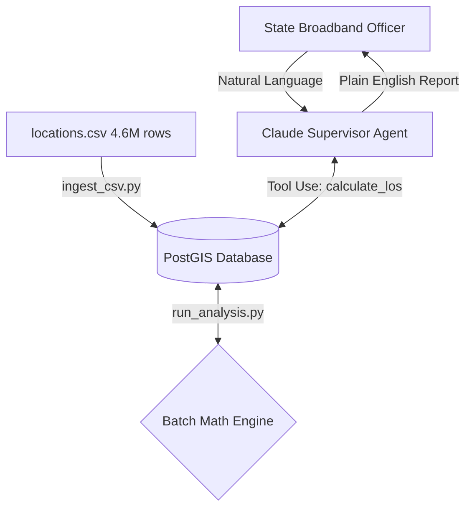

```mermaid
graph TD
    A[locations.csv 4.6M rows] -->|ingest_csv.py| B[(PostGIS Database)]
    B <-->|run_analysis.py| C{Batch Math Engine}
    
    D[State Broadband Officer] -->|Natural Language| E[Claude Supervisor Agent]
    E <-->|Tool Use: calculate_los| B
    E -->|Plain English Report| D
```