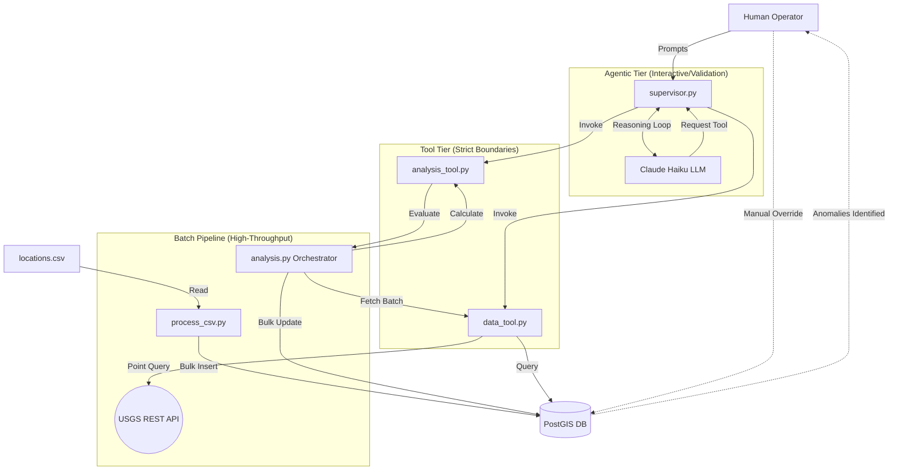

# System Architecture & Agent Workflow

This document outlines the system architecture, state management, and multi-agent tool boundaries for the broadband line-of-sight risk evaluation pipeline.

## Architecture Diagram

The system operates on a hub-and-spoke model where the PostGIS database acts as the central state machine. 



## Tool Schemas

### fetch_location_data
- Input: location_id (string)
- Output: tcc_percentage, elevation, obstruction_height
- Error: returns error dict if location not found

### calculate_los  
- Input: dish_elev, obstruction_elev, obstruction_dist, canopy_height (all float)
- Output: obstruction_height, obstruction_angle, risk_tier, reason
- Error: returns risk_tier C if obstruction_dist <= 0


## State Management

The location_evaluation table acts as the central state machine for 
the entire pipeline. Every location moves through a defined set of statuses:

| Status | Meaning |
|--------|---------|
| P | Pending — inserted by process_csv.py, awaiting analysis |
| D | Done — successfully scored by analysis.py |
| A | Anomaly — flagged due to bad or missing environmental data |
| E | Error — reserved for critical processing failures |

This single column coordinates all agents without requiring inter-process 
communication. The batch pipeline polls for `status = 'P'` to find unprocessed 
rows. The Supervisor Agent reads rows with `status = 'D'` to retrieve scored 
results. A human operator can manually reset a row from `status = 'A'` back to 
`status = 'P'` to trigger reprocessing after investigation. This design means 
the pipeline is fully restartable — if it crashes mid-batch, it picks up exactly 
where it left off on the next run.

## Failure Handling

The pipeline handles failures at three levels:

Row-level anomalies If the USGS elevation API returns -1.0 (timeout or 
error), or if TCC is null or outside the 0-100 range, the row is flagged 
as an anomaly (status = 'A') rather than silently assigned a default value. This 
preserves data integrity — anomalous rows are identifiable and reprocessable 
rather than silently corrupted.

Batch-level failures If a database error occurs mid-batch, psycopg2 rolls 
back the entire uncommitted batch. No partial writes reach the database. The 
affected rows retain status = 'P' and will be picked up on the next run.

API failures The USGS elevation API has a 5-second timeout. On failure, 
fetch_elevation() returns -1.0 which triggers the anomaly guard above. The 
pipeline continues processing remaining rows in the batch rather than halting.

Human intervention point Rows with status = 'A' are visible in the insights 
report and can be manually inspected. An operator can run:
```sql
UPDATE location_evaluation SET status = 'P' WHERE status = 'A';
```
to requeue all anomalies for reprocessing once the underlying issue is resolved.